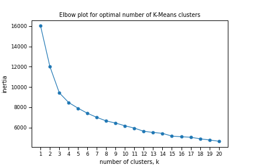

# Charlotte Hornets Four-Factors Analysis and Player Clustering

> In this project, I analyze the Charlotte Hornets basketball team regarding the Four Factors by Dean Oliver. These are **Shooting**, **Turnovers**, **Rebounding**, and **Free Throws**.
>
> I first analyze the Charlotte Hornets Basketball team and how they compare in these Four Factors based in the following configurations:
>
> - Past season (2020) versus the Current season (2021)
>
> - Past season (2020) versus the league average (2020)
>
> - Current season (2021) versus the league average (2021)
>
> I then create a linear regression model using data from 2011 through and including the 2018   regular NBA season using the differences in the offensive and defensive four factors. Using this model, I can predict how many games the Hornets should have won in the 2020 season, had they played a full season.
>
> Last, I group NBA players together based on their career statistics using Principal Component Analysis (PCA) and K-Means clustering. All variables are standardized before undergoing dimensionality reduction via PCA. 
>
> I used this clustering to group players on the Charlotte Hornets.

## Data Preparation

#### Four Factors Analysis

>  I obtain data using the sportsipy package in Python. I start with specifying what seasons I want to compare (see cell 2), which are the 2020 and 2021 season. 
>
>  I then calculate the Offensive and Defensive Four Factors for a team. I experimented with using numpy to speed up the calculations, although working with a pandas syntax would have sufficed. I found it easier to work with variables rather than referencing column names in a pandas dataframe.

#### Player Career Clustering

> I obtain data using a combination of the sportsipy and basketball_reference_scraper packages in Python. I grab each active in the current NBA season (2020-2021) and filter by their careers. Some statistics are not reported, such as points-per-game or assists-per-game. I calculate these manually based on how many reported games a player has played in their career.
>
> **Note**: I filter by NBA players who have had at least 500 minutes played. 

## Analysis


> In the 2020 season, the Hornets were shooting worse than the league average, turning the ball over more, and failing to get to the free throw line; however, they excelled at grabbing offensive rebounds. On defense, it is notable that the Hornets are poor at rebounding under their own basket, but they do foul their opponents less than the league average in 2020.


> **So how have the Hornets improved between the 2020 season and the 2021 season?**
>
> A few draft picks can turn things around. The Hornets are shooting the ball better by about 3.4%. It looks like they aren't attacking the paint as much, but they are grabbing more rebounds under their own basket. They may play better defense, but their young roster is fouling the opponent more.


> **How do the Hornets compare with the rest of the league this season (2021)?**
>
> The Hornets are keeping up with the rest of the league in a few categories. They are on-par with shooting percentage, but their young roster may punish them as they turn the ball over more on offense. They are getting to the free throw line less on offense. Their opponents are shooting better versus them than in the league average. Luckily, the Hornets are fouling less than the league average, but this gap is closing as the league average is going down while the Hornets' opponent's free throw rate (OFTR) is going up.

## Modeling

#### Linear Regression to predict wins in a season

> I created a linear regression model for the using the Four Factors found in Wayne Winston's book *Mathletics*. These are the following:
>
> - eFG% - OeFG% = Effective Field Goal Percentage - Opponent's Effective Field Goal Percentage
> - TPP - DTPP = Offensive Turnovers Per Possession - Defensive Turnovers per Possession
> - ORP - DRP = Offensive Rebound Percentage - Defensive Rebound Percentage
> - FTR - OFTR = Free Throw Rate - Opponent's Free Throw Rate
>
> The graph below shows the importance of each feature. **Note**: This is just one model and there is some oversight I address in the Conclusions section.


> 
>
> Using this model, we can predict how well the Hornets should have performed in the 2020 season, adjusting for a short season of play.
>
> ```
> The Charlotte Hornets won 23 games in the 2020 season. Based on their performance with respect to the Offensive and Defensive Four Factors, we predict their total wins to be 27 wins in a full season of 72 games.
> 
> Because of the circumstances of COVID-19, they did not play a full 72-game season.
> 
> In the 2020 season, the Charlotte Hornets have played 65 games.
> Their expected wins as a ratio of 27/72 games is 24.
> The Charlotte Hornets are performing below expectations for the 2020 season.
> ```

#### K-Means Clustering of Player Careers

> I standardize all 49 features used and determine the optimal number of principal components explaining about 90% of the variance to be 10. I then use an elbow plot to determine the optimal number of clusters for players.
>
> The optimal number of clusters is **10**, though there is some wiggle room after 4 clusters. This can be seen in the elbow plot below.



> I then use this K-Means clustering model to classify the current Charlotte Hornets roster.

## Conclusions and Limitations

> Limitations to Linear Regression:
>
> - The model places great importance on shooting and turnovers. Rebounding does not affect it at all.
> - Requires more thorough data cleaning: I made a mistake, not knowing that one season  in my dataset was cut short (The 2011 NBA lockout). For future analyses, it would be more appropriate to exclude it OR adjust a team's wins as a ratio of 66 regular season games.
> - The NBA is changing, so data from the past decade may not be as relevant as more recent data, such as the past 5 seasons.

> There are some limitations to K-Means clustering. These are:
>
> - Unknown optimal number of clusters
>
> - Some statistics in basketball that aren't captured, such as when a player screens. 
>
> - Player careers are not complete profiles for younger players.
>
> - Bench players that go from the bench in one season to starting in the next may have vastly different stat lines, such as Joe Harris of the Brooklyn Nets.
>
> The takeaway here is that there may not be an appropriate sample size of games for younger players.

